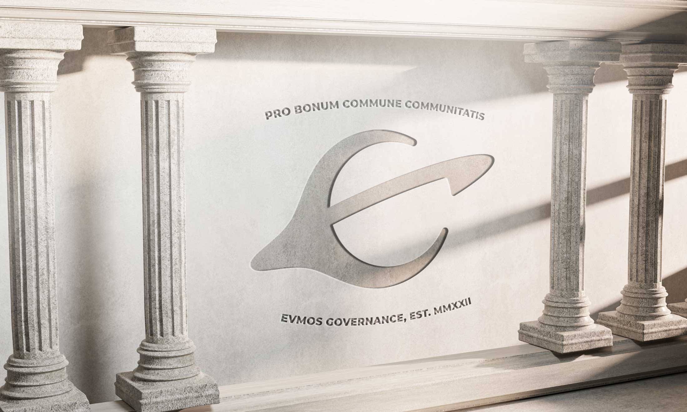

import Bleed from 'nextra-theme-docs/bleed'

# Evmos DAO & Community Governance

## Introduction to Evmos

**Evmos** is an [EVM-compatible Layer One Network](https://evmos.org) in the Cosmos ecosystem.

## Evmos DAO 

**Evmos DAO** is the community-led & organized decentralized organization dedicated with aligned goals with the Evmos Foundation to continue to build the Evmos ecosystem.

The DAO is currently operating under the [Interim Constitution](/constitution), which was passed by the Evmos community in [Proposal #51.](https://www.mintscan.io/evmos/proposals/51)

The **Evmos Governance Framework** is still a work-in-progress, and will be rolled out in a modular fashion. The Framework, like the Interim Constitution, are likely to change and evolve as the network matures and grows. This document repository will be updated to the best of our ability to remain up-to-date.

<Bleed></Bleed>
